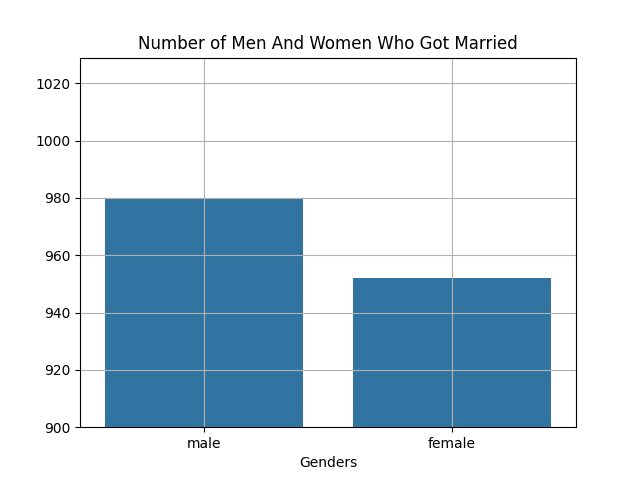
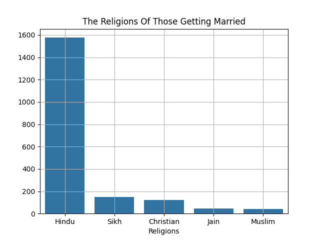
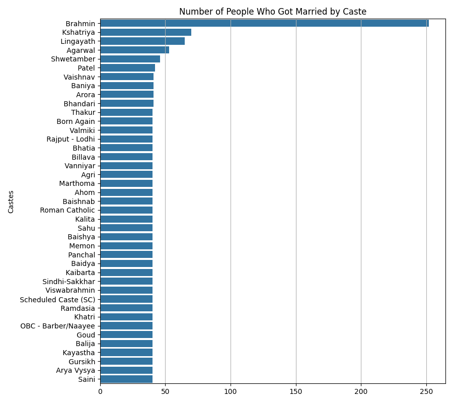
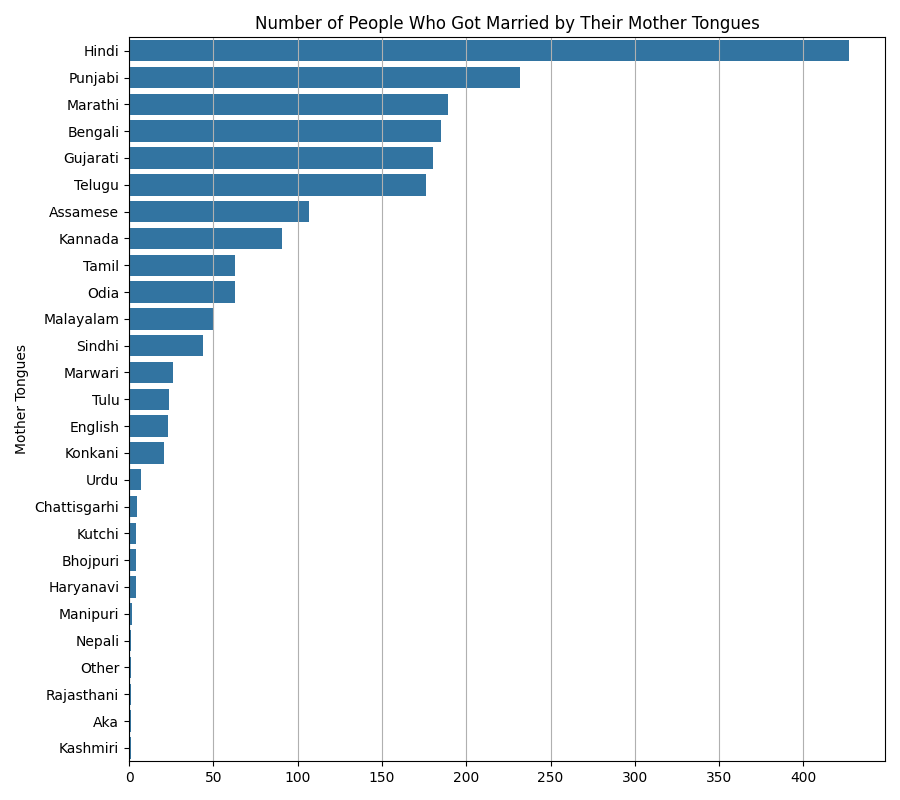
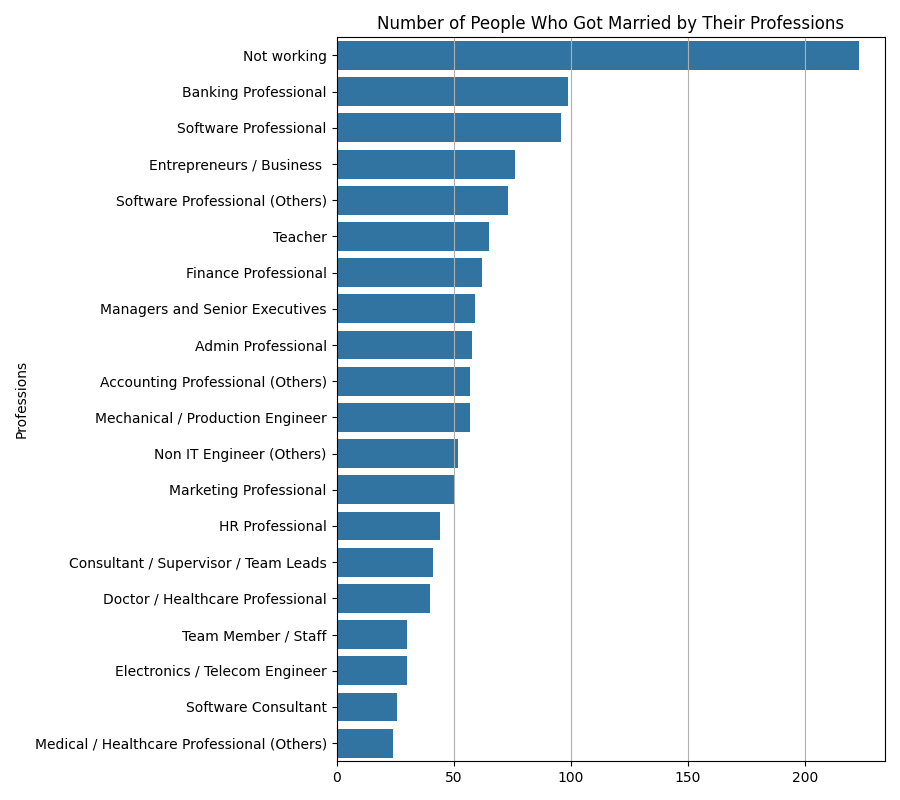
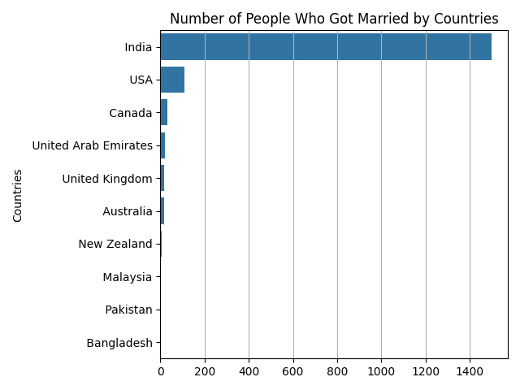
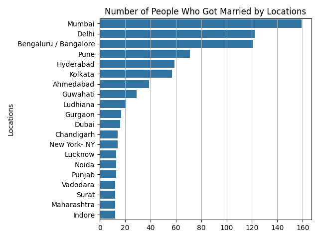
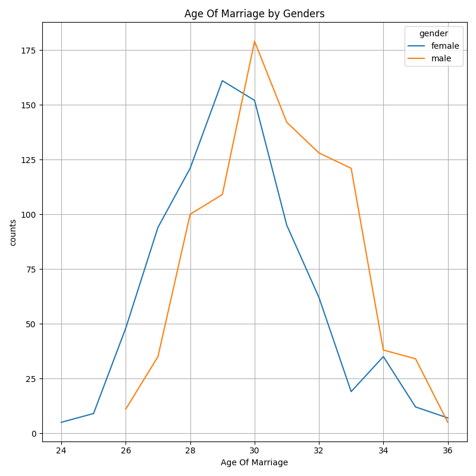
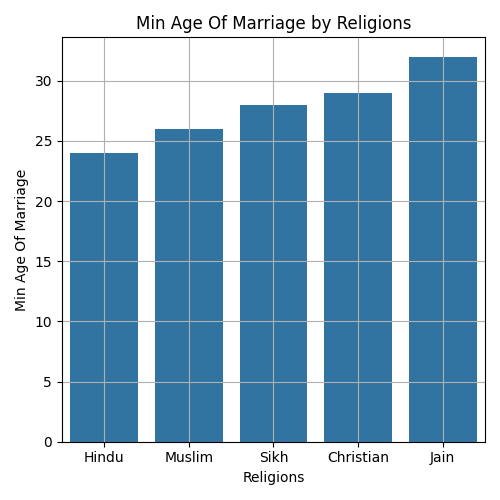
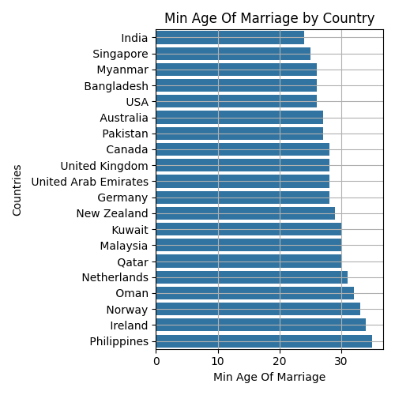

#  Marriage Dataset Analysis

##  Overview

This project presents an **Exploratory Data Analysis (EDA)** of a structured marriage dataset containing demographic, cultural, and socio-economic attributes of individuals.

The analysis focuses on identifying **patterns, distributions, and potential relationships** between variables such as:

* Gender
* Height
* Religion
* Caste
* Mother tongue
* Profession
* Location
* Country
* Age of marriage

---

##  Technologies & Libraries

The analysis was conducted using the following Python libraries:

* **Pandas** → Data manipulation and preprocessing
* **NumPy** → Numerical operations
* **Matplotlib** → Data visualization
* **Seaborn** → Statistical data visualization

---

##  Data Preprocessing

The dataset required several preprocessing steps:

* Handling missing values (`dropna`)
* Converting height values from string format to numeric
* Type casting (`float → int`)
* Removing undefined categories (e.g., `"Not Specified"`)

⚠️ **Important Note:**
Dropping all rows with missing values may introduce **sampling bias** and reduce dataset representativeness.

---

## 📈 Exploratory Data Analysis

### 👥 Gender Distribution

* The dataset contains slightly more male entries than female.
* This reflects **dataset composition**, not real-world population ratios.

---

### 🛐 Religion Distribution

* The dataset is heavily dominated by **Hindu individuals**.
* This indicates **sampling concentration**, not higher marriage rates.

---

### 🧬 Caste Distribution

* Certain caste groups (e.g., Brahmin) appear more frequently.
* This reflects **uneven representation**, not necessarily social preference.

---

### 🗣️ Mother Tongue Distribution

* Hindi is the most frequent language.
* Suggests strong **geographical concentration (India)** in the dataset.

---

### 💼 Profession Distribution

* Some professions, including *“Not working”*, are more frequent.
* This does **not imply causation** between profession and marriage.

---

### 🌍 Country Distribution

* The dataset is predominantly composed of individuals from **India**.
* Indicates **sampling bias**, not global marriage trends.

---

### 📍 Location Distribution

* Most locations are Indian cities.
* Confirms dataset’s **regional concentration**.

---

### 📊 Age of Marriage by Gender

* Women tend to marry slightly earlier than men on average.
* The plot shows **distribution patterns**, not strict statistical models.

---

### ⛪ Minimum Age by Religion

* Shows minimum observed values only.
* ⚠️ Minimum values are sensitive to **outliers** and not reliable indicators.

---

### 🌎 Minimum Age by Country

* Displays minimum marriage age across countries.
* Does **not represent marriage rates**.

---

##  Correlation Analysis

| Feature       | Observation                       |
| ------------- | --------------------------------- |
| Height vs Age | Weak positive correlation (~0.20) |
| ID vs Others  | No meaningful relationship        |

 Interpretation:

* No strong linear relationships exist between numeric variables.
* Observed correlations are **statistically weak**.

---

##  Limitations

* **Sampling Bias:** Dataset heavily represents India
* **Missing Data Handling:** Dropping rows may distort distributions
* **Feature Representation:** Some categories are imbalanced
* **Causality:** Analysis is descriptive, not causal

---

##  Key Insights

* The dataset is **not globally representative**
* Cultural and regional concentration is evident
* Gender-based differences in marriage age exist (slight)
* No strong numerical predictors for age of marriage were found

---

##  Future Improvements

* Apply **missing value imputation** instead of dropping
* Perform **statistical hypothesis testing**
* Use **median-based comparisons** instead of minimum values
* Build **predictive models (regression/classification)**
* Normalize dataset for **balanced representation**

---

##  Author

**Elif Asya Tanrıvere**
Computer Engineering Student

---

##  Final Note

This project is an **EDA-focused study** aimed at understanding data structure and distributions.
All interpretations are made with awareness of **dataset limitations and potential biases**.
